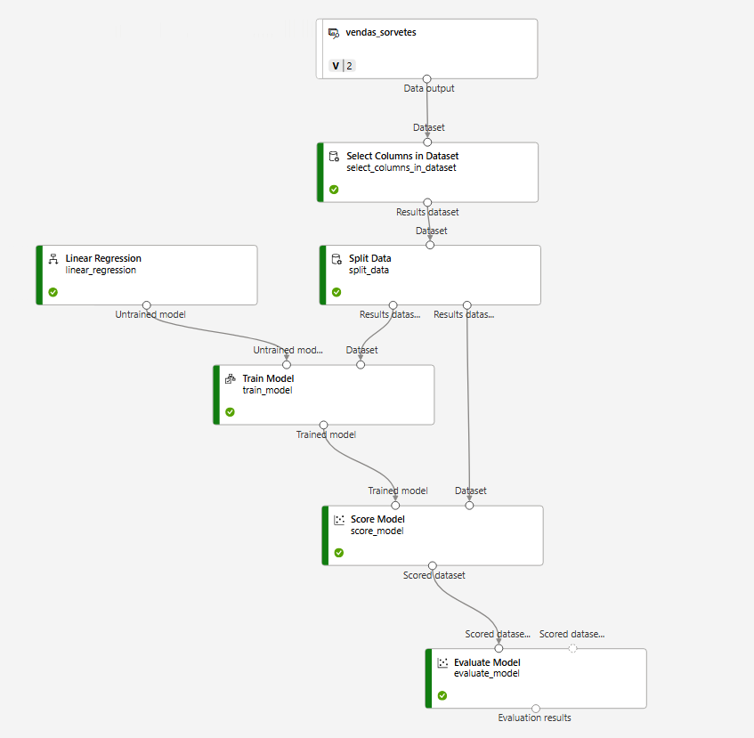
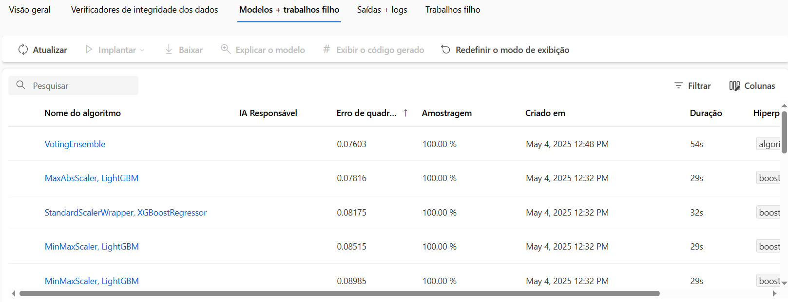

# 🍦 Gelato Mágico - Previsão de Vendas com Machine Learning

## 📊 Desafio de Regressão com Azure Machine Learning (DIO)

Este projeto tem como objetivo prever a quantidade de sorvetes vendidos com base na **temperatura do dia**, utilizando técnicas de **Machine Learning em nuvem**, através do **Azure Machine Learning Studio**. Uma solução prática e escalável, ideal para otimizar a produção de uma sorveteria litorânea chamada *Gelato Mágico* 🌴.

---

## 🧠 Objetivo do Projeto

- Construir um **modelo preditivo de regressão** para estimar as vendas de sorvete com base na temperatura ambiente.
- Utilizar **AutoML no Azure ML Studio** para encontrar o melhor modelo.
- Registrar e implantar (deploy) o modelo na nuvem com **endpoint para consumo em tempo real**.
- Criar um pipeline automatizado para garantir reprodutibilidade.
- Expor o modelo via API e demonstrar como consumir seus resultados com Python.

---

## 🏝️ Contexto (Storytelling)

A *Gelato Mágico* é uma sorveteria charmosa em uma cidade litorânea do Brasil. Seu dono percebeu que a **temperatura** influencia diretamente a **demanda de sorvetes**, mas não sabia como transformar esse *feeling* em números.

Então, decidimos **utilizar IA** para **antecipar a demanda** com base nas previsões de temperatura, evitando tanto o **desperdício por excesso de produção**, quanto a **perda de vendas por falta de estoque**.

---

## 🛠️ Tecnologias Utilizadas

- Python
- Azure Machine Learning Studio
- AutoML (Regressão)
- MLFlow
- API REST para consumo
- Pandas e Numpy (pré-processamento)
- GitHub (repositório)
- Excel (dados simulados)

---

## 🗂️ Estrutura do Projeto

```bash
.
├── inputs/
│   └── dados_vendas_sorvete.csv        # Dados simulados
├── consumir_modelo.py                  # Script de consumo da API
├── modelo_azure_pipeline.png           # Print do pipeline
├── modelo_azure_consumo.png            # Print do endpoint funcionando
├── resultados_avaliacao.txt            # Métricas do AutoML
└── README.md                           # Este arquivo!
````

---

## 🧪 Etapas Realizadas

1. **Simulação dos Dados**

   * Geramos dados com base em temperaturas entre 18 °C e 40 °C e suas respectivas vendas (valores reais simulados).

2. **Criação do Experimento no Azure AutoML**

   * Usamos o tipo *Regressão*.
   * Variável dependente: `vendas_sorvete`
   * Feature: `temperatura_celsius`
   * Algoritmo selecionado: `VotingEnsemble`

3. **Criação do Pipeline**

   * Pipeline estruturado com dataset + pré-processamento + treinamento

4. **Implantação na Nuvem (Deploy)**

   * Criamos um endpoint REST público e testamos com o código de consumo gerado automaticamente.

5. **Consumo da API**

   * Utilizamos `urllib` em Python para fazer requisição e prever valores de venda.

---

## 📷 Print do Processo

*
 
*
  
*

---

## 📈 Resultados

* **R² Score:** `0.86264`
* **MAE (Erro Médio Absoluto):** `12.289`

> Resultados excelentes para um modelo simples baseado em apenas uma feature (temperatura). Mostra o poder do AutoML na prática! 🚀

---

## 🚀 Como usar o modelo (consumo da API)

```python
import urllib.request
import json

data = {
  "data": [
    {"temperatura_celsius": 30}
  ]
}

body = str.encode(json.dumps(data))

url = 'URL do seu endpoint aqui'
api_key = ' Sua API Key'
headers = {'Content-Type':'application/json', 'Authorization':('Bearer '+ api_key)}

req = urllib.request.Request(url, body, headers)

response = urllib.request.urlopen(req)
result = response.read()
print(result)
```

---

## 📌 Aprendizados

* Entendi como aplicar IA na nuvem de forma estruturada e realista
* Aprofundei o uso de **pipelines e AutoML no Azure**
* Conheci o ciclo completo de um projeto de Machine Learning moderno:

  * Dados → Treinamento → Registro → Deploy → Consumo via API

---

## ✨ Resultado

Projeto entregue com sucesso e pronto para integrar ao portfólio!

🔗 **Link para o projeto publicado:**
[https://github.com/SeuUsuario/gelato-magico-ml-regression](https://github.com/Azaphz/gelato-oracle)*

---

**Feito com carinho, propósito e inteligência artificial 🧠💙🍦**

